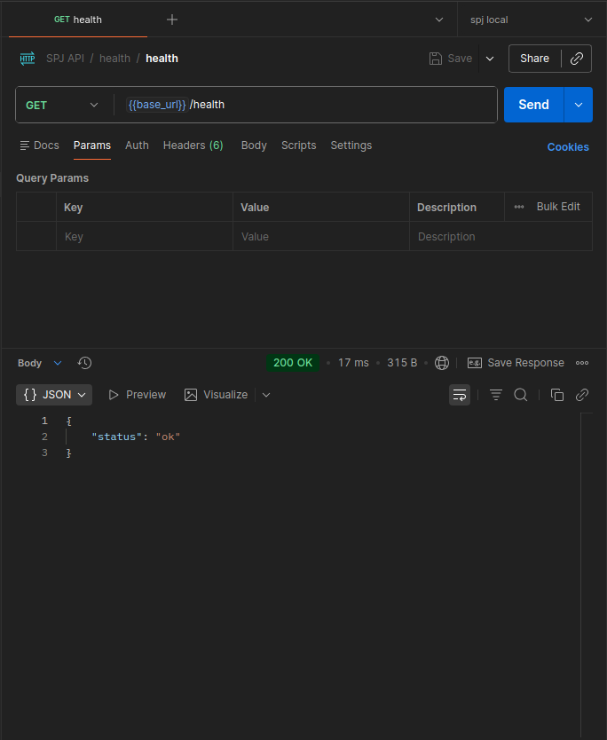
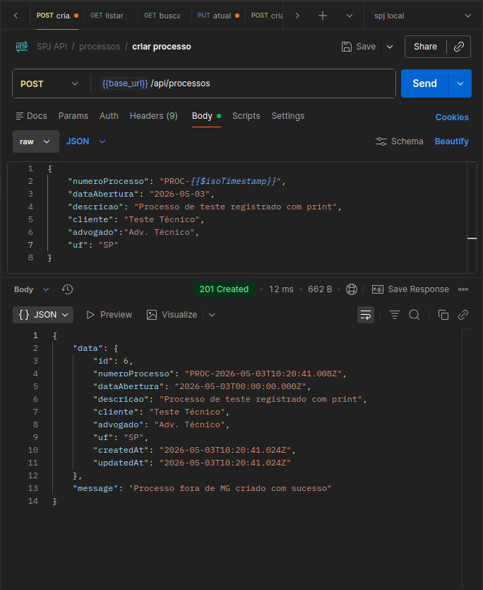
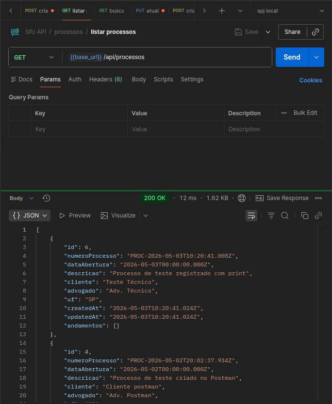
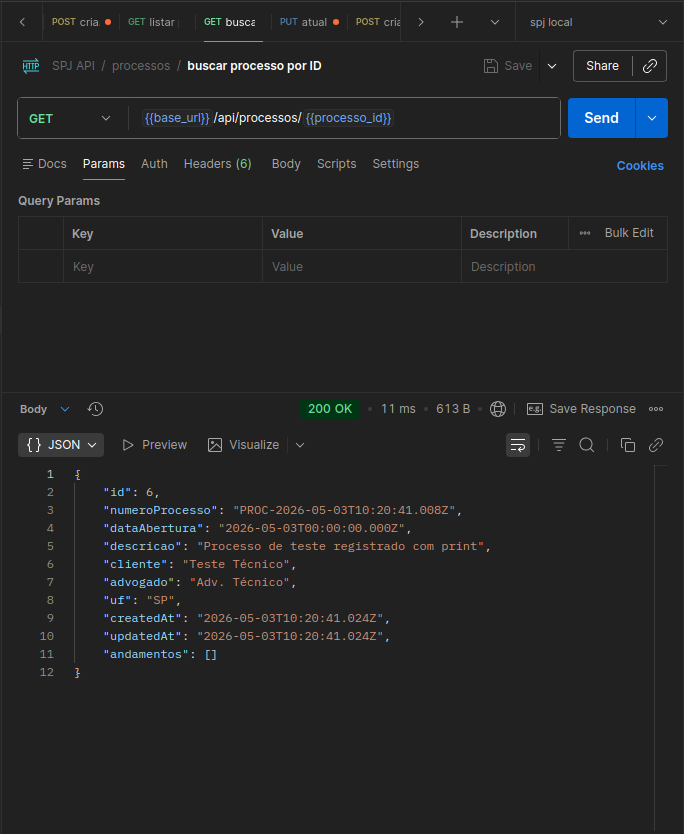
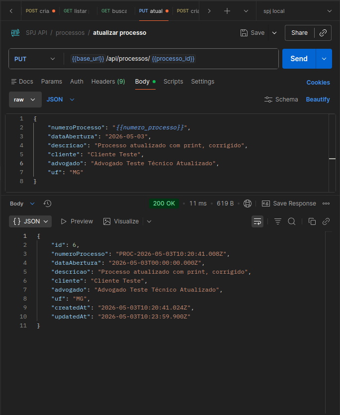
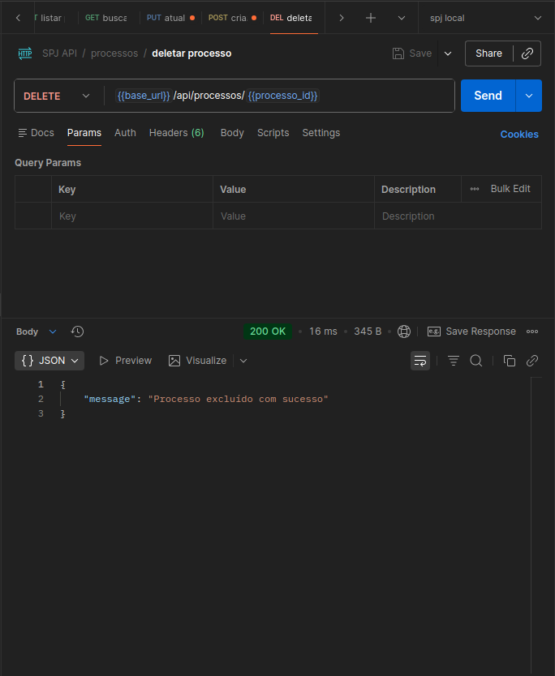
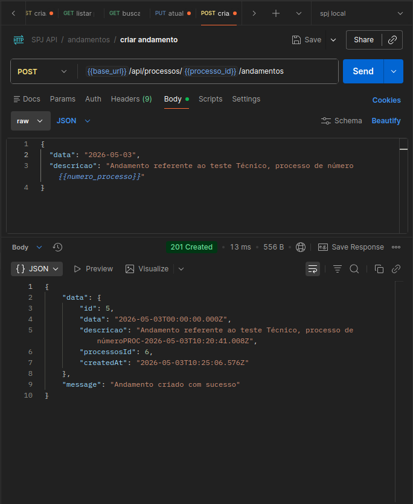
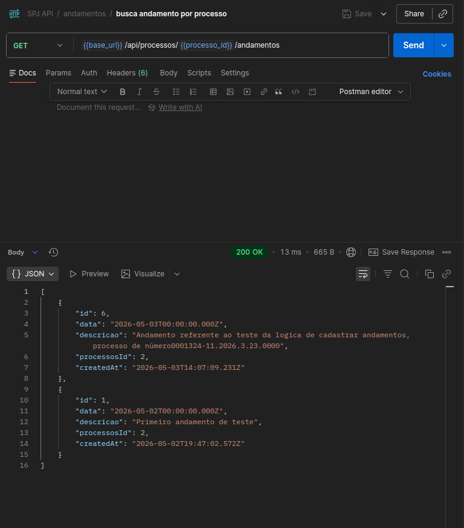
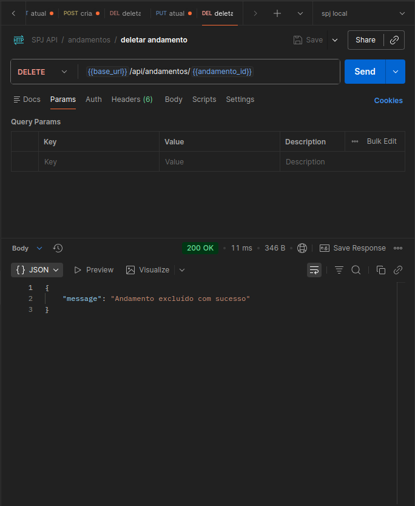
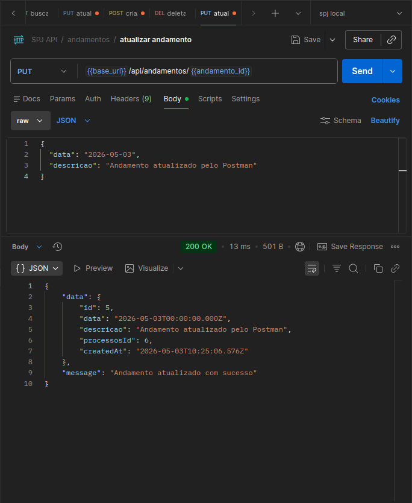

# Backend SPJ

Backend do SPJ (Sistema de Processos Judiciais), desenvolvido com Node.js, Express, Prisma ORM e PostgreSQL.

## Requisitos

Antes de iniciar, tenha instalado:

- Node.js
- npm
- Docker
- Docker Compose

## Tecnologias usadas

| Recurso | Tecnologia |
| --- | --- |
| Runtime | Node.js |
| API | Express |
| ORM | Prisma |
| Banco de dados | PostgreSQL |
| Ambiente local | Docker Compose |

## Como rodar com Docker

Este e o fluxo recomendado para o teste tecnico. O Docker Compose sobe o PostgreSQL e o backend juntos.

Na raiz do repositório, execute:

```bash
docker compose up --build
```

O Compose vai:

- criar o container `spj_db` com PostgreSQL;
- criar o container `spj_backend` com Node.js;
- aguardar o banco ficar pronto;
- executar `npx prisma generate`;
- aplicar as migrations com `npx prisma migrate deploy`;
- iniciar a API com `npm start`.

A API ficara disponivel em:

```text
http://localhost:3001
```

Teste se o backend esta respondendo:

```bash
curl http://localhost:3001/health
```

Resposta esperada:

```json
{
  "status": "ok"
}
```

Para parar os containers:

```bash
docker compose down
```

Para parar os containers e apagar o volume do banco local:

```bash
docker compose down -v
```

Use `-v` apenas quando quiser recriar o banco do zero.

Se a porta `3001` ja estiver em uso, pare o processo local que estiver rodando nela e execute novamente:

```bash
docker compose up --build
```

## Como o backend está configurado no Docker

O PostgreSQL e configurado pelo arquivo `docker-compose.yml` que fica na raiz do projeto.

Serviço do banco:

```text
container: spj_db
host interno no Docker: db
porta externa: 5432
banco: spj_db
usuario: postgres
senha: postgres
```

Serviço do backend:

```text
arquivo: backend/Dockerfile
container: spj_backend
porta externa: 3001
porta interna: 3001
```

Dentro do Docker, o backend nao usa `localhost` para acessar o banco. Ele usa o nome do serviço do Compose:

```env
DATABASE_URL="postgresql://postgres:postgres@db:5432/spj_db?schema=public"
```

Isso acontece porque, dentro da rede do Docker Compose, `db` e o endereco do container PostgreSQL.

## Comandos uteis

| Comando | Onde executar | Finalidade |
| --- | --- | --- |
| `docker compose up -d db` | Raiz do projeto | Sobe o PostgreSQL |
| `docker compose ps` | Raiz do projeto | Lista containers ativos |
| `docker compose up --build` | Raiz do projeto | Sobe banco e backend com Docker |
| `docker compose down` | Raiz do projeto | Para os containers |
| `docker compose down -v` | Raiz do projeto | Para containers e apaga o volume do banco |
| `npm install` | `backend` | Instala dependencias |
| `npx prisma migrate dev` | `backend` | Aplica migrations no banco local |
| `npx prisma generate` | `backend` | Gera o Prisma Client |
| `npm run dev` | `backend` | Inicia a API em desenvolvimento |
| `npm start` | `backend` | Inicia a API com Node |

## Contrato de API

### Health check

| Metodo | Rota | Descricao |
| --- | --- | --- |
| GET | `/health` | Verifica se a API esta respondendo |

### Processos

| Metodo | Rota | Descricao |
| --- | --- | --- |
| GET | `/api/processos` | Lista processos |
| GET | `/api/processos/:id` | Detalha um processo |
| POST | `/api/processos` | Cria um processo |
| PUT | `/api/processos/:id` | Atualiza um processo |
| DELETE | `/api/processos/:id` | Remove um processo |

### Andamentos
| Metodo | Rota | Descricao |
| --- | --- | --- |
| GET | `/api/processos/:id/andamentos` | Lista andamentos do processo |
| POST | `/api/processos/:id/andamentos` | Cria um andamento |
| GET | `/api/andamentos/:id/` | Busca andamento por id unico | 
| PUT | `/api/andamentos/:id` | Atualiza um andamento |
| DELETE | `/api/andamentos/:id` | Remove um andamento |

## Ver no Prisma Studio

Com o banco e backend funcionando:

```bash
cd backend
npx prisma studio
```

Abra a URL exibida no terminal e confira as tabelas `processos` e `andamentos`.

## Testes de API
### **Health check**: `GET: {{base_url}}/health`


---
### **Novo Processo**: `POST: {{base_url}}/api/processos`

---
### **Listar Processos**: `GET: {{base_url}}/api/processos`

---
### **Buscar Processos**: `GET: {{base_url}}/api/processos/{{processo_id}}`

---
### **Atualizar Processos**: `PUT: {{base_url}}/api/processos/{{processo_id}}`

---
### **Deletar Processos**: `DELETE: {{base_url}}/api/processos/{{processo_id}}`

---
### **Novo Andamento**: `POST: {{base_url}}/api/processos/{{processo_id}}/andamentos`

---
### **Busca Andamento por Processo**: `GET: {{base_url}}/api/processos/{{processo_id}}/andamentos`

---
### **Buscar Andamento por ID unico**: `GET: {{base_url}}/api/andamentos/{{andamento_id}}`

---
### **Atualizar Andamento**: `PUT: {{base_url}}/api/andamentos/{{andamento_id}}`

---
### **Deletar Andamento**: `DELETE: {{base_url}}/api/andamentos/{{andamento_id}}`

---


